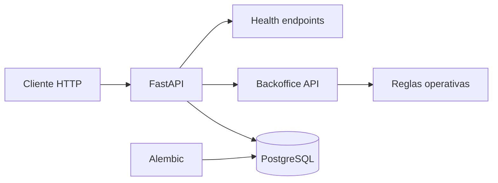

# Arquitectura base

## Objetivo actual

Dejar un backend pequeno, corrible y verificable que ya soporte el flujo operativo minimo del caso ART/incidente.

## Componentes

- API `FastAPI`
- base de datos `PostgreSQL`
- acceso a datos `SQLAlchemy async`
- migraciones `Alembic`
- routers para `patients`, `encounters`, `incident_cases`, `case_events` y `case_documents`

## Diagrama

## Decision de diseno

La implementacion actual evita capas innecesarias. Incluye solo lo que necesitamos para:

- correr la API;
- verificar vida y readiness;
- abrir una conexion async a PostgreSQL;
- tener migraciones reproducibles;
- crear y consultar el caso operativo;
- dejar tooling basico para seguir construyendo.
